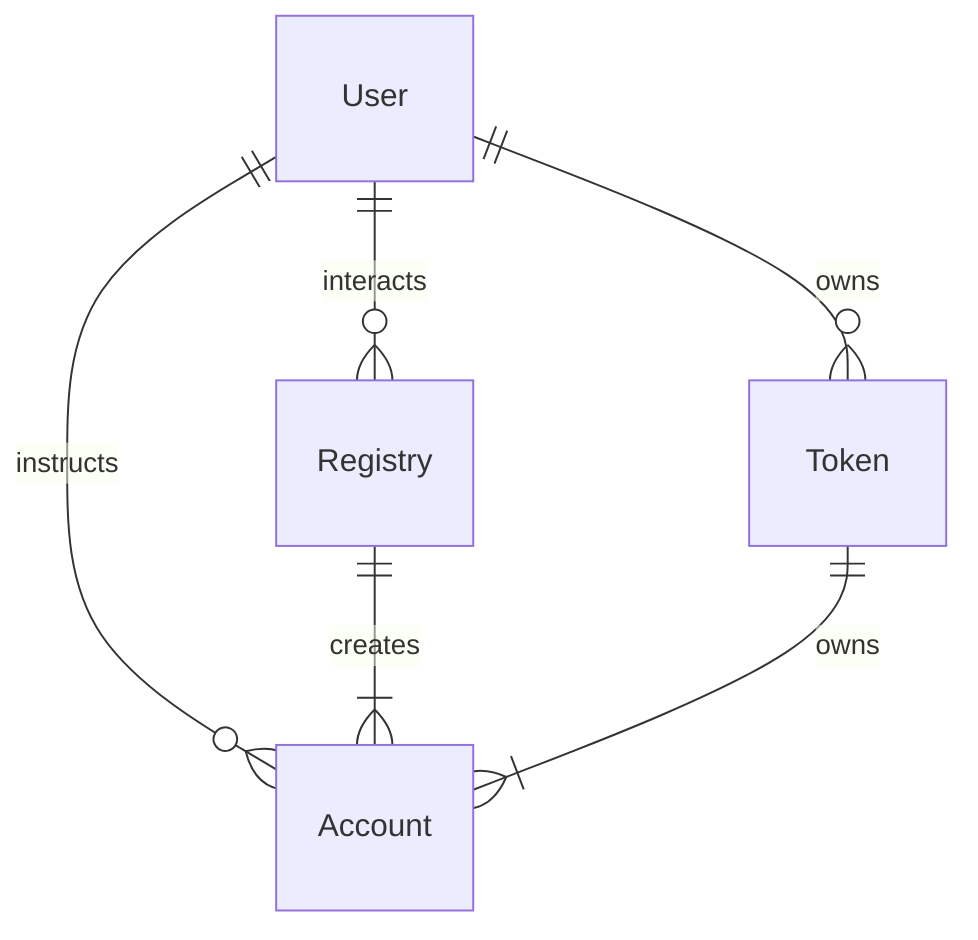
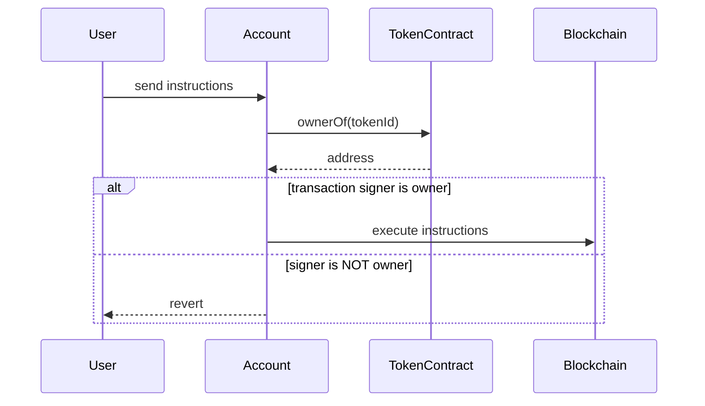
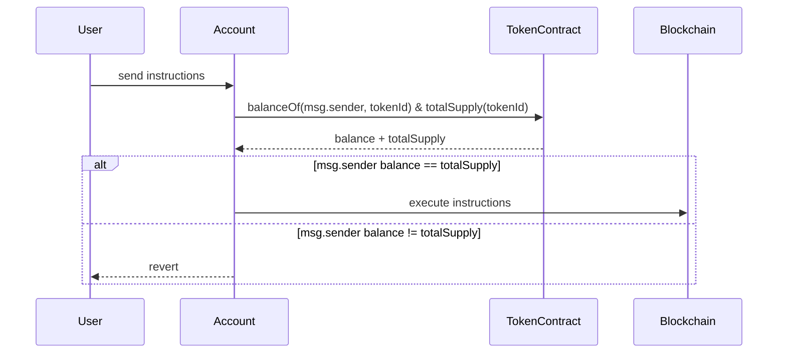

# Example Project Showcasing Account Abstraction Bound to an NFT

This project demonstrates a Token Bound Account (TBA) implementation.

1. An `ERC6551Account` implementation is deployed in conjunction with a `ERC6551Registry` and a Token Contract.
2. The registry calculates an address based on an input and deploys the Account Implementation to that address.
3. The ERC721 example utilizes `ownerOf(tokenId)` to ensure that only the owner of a specific tokenId can instruct a TBA.
4. An alternative example demonstrates that owning all tokens of an ERC1155 tokenId also qualifies one as the owner.

The ERC6551 Contracts are extracted and derived from: https://github.com/vechain/token-bound-accounts

## ERC721

Contracts:

1. `ERC6551/Account-ERC721.sol` serves as the Account and includes all necessary access checks.
   * The owner is defined as the holder of a tokenId within the NFT contract.
2. `ERC6551/Registry.sol` is responsible for creating accounts and calculating addresses based on contract addresses and Token IDs.
3. `NFT.sol` serves as an example NFT Contract.

Scripts:

1. `ERC6551/01_Deploy.ts` handles the deployment of the Account Abstraction related contracts.
2. `NFT/01_Deploy.ts` deploys the NFT.
3. `NFT/02_Mint_Token-0.ts` mints a Test-Token and, if necessary, creates a new Account using `Registry.createAccount()`.
4. `NFT/03_TBA_Send_Test.ts` demonstrates an example interaction with the Account by transferring its VET or VTHO balance to the owner.

## ERC1155

Contracts:

1. `ERC6551/Account-ERC1155.sol` functions as the Account and includes all access checks.
   * The owner is defined as the individual holding all tokens of a specific token ID.
   * **This is just a demonstration; do not use in production.**
2. `ERC6551/Registry.sol` is tasked with creating accounts and calculating addresses based on contract addresses and Token IDs.
3. `MultiToken.sol` serves as an example MultiToken Contract.

Scripts:

1. `ERC6551/01_Deploy.ts` deploys the Account Abstraction related contracts.
2. `MultiToken/01_Deploy.ts` deploys the MultiToken.
3. `MultiToken/02_Mint_Token-0.ts` mints a token for Token ID 0 and, if necessary, creates a new Account using `Registry.createAccount()`.
4. `MultiToken/03_TBA_Send_Test.ts` demonstrates an example interaction with the Account by transferring its VET or VTHO balance to the owner.

